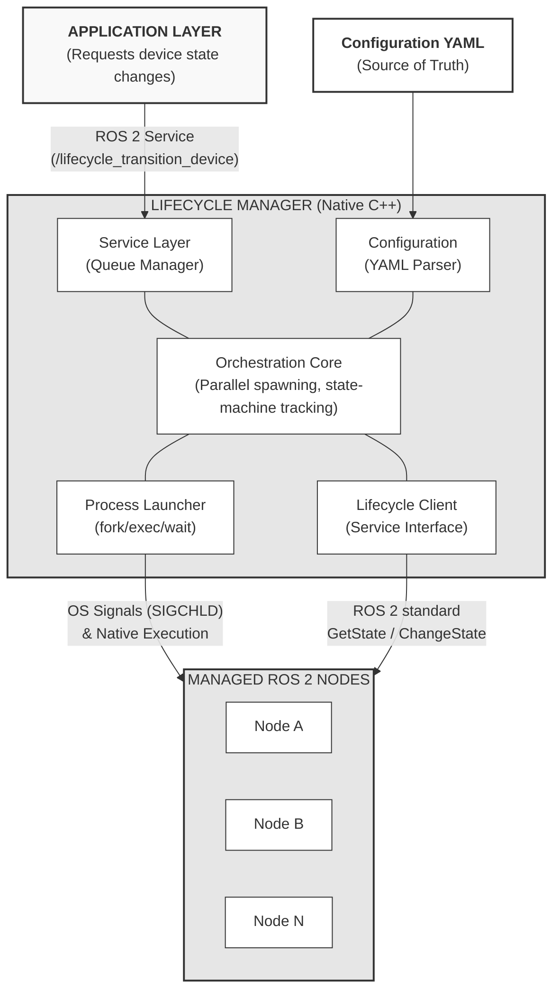
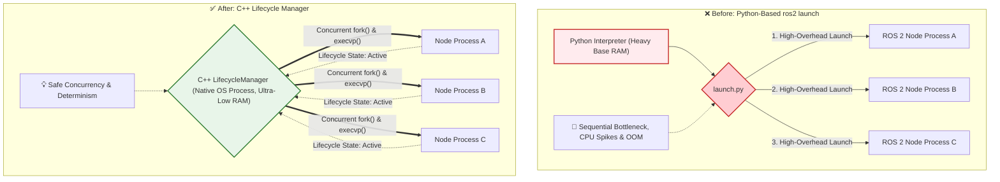
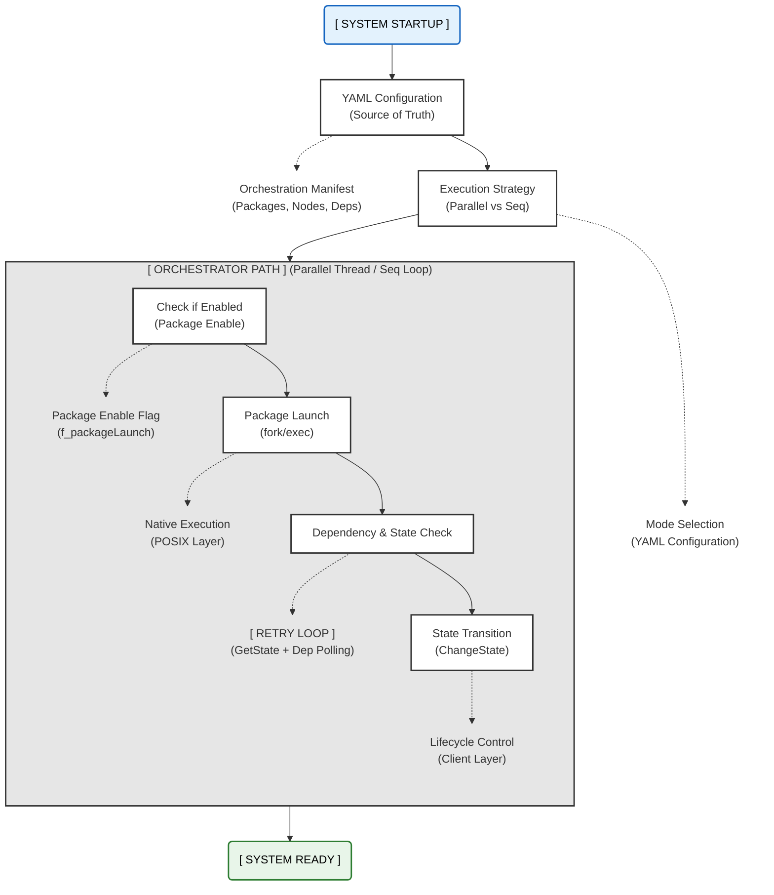

# A.RobotAI-LGE-ROS2-LifecycleManager
A C++ deterministic lifecycle orchestrator optimized for ROS 2 embedded systems.
>
> 🚧 **[NOTICE] Project Status**
>
> This repository provides architectural documentation, YAML-based configuration
> examples, and empirical validation results for the Deterministic Lifecycle Manager.
>
> The execution model, lifecycle semantics, dependency resolution strategy, and
> performance characteristics are fully documented here to allow technical review
> and reproduction of system behavior.
>
> The complete C++ source code is planned to be released under the Apache License 2.0
> following internal corporate compliance procedures.

A production-grade, C++ deterministic lifecycle orchestrator optimized for resource-constrained ROS 2 embedded systems.
## 📑 Table of Contents
1. [Overview - "What & Why?"](#1-overview---what--why)
2. [Structural Pain Points in Production Systems](#2-structural-pain-points-in-production-systems)
3. [Architecture & LifecycleManager](#3-architecture--lifecyclemanager)
4. [Deterministic Boot Flow (Deep-dive)](#4-deterministic-boot-flow-deep-dive)
5. [Metrics & Validation](#5-metrics--validation)
6. [Source, Build & License](#6-source-build--license)
---
## 1. Overview - "What & Why?"
This document introduces the **"Deterministic Lifecycle Manager"**, a C++‑based lifecycle orchestration service designed to run ROS 2 reliably on low‑end embedded robotic platforms.
The target systems are cost-constrained commercial robotic platforms built on entry-level SoCs such as **Rockchip PX30, LG DQ1**, or other Cortex-A35-class CPUs, typically equipped with **less than 1GB of RAM**. On these platforms, boot-time behavior and peak resource usage critically impact system stability.
### 🔴 Motivation
During system integration and production‑equivalent platform evaluation, we repeatedly encountered critical issues when using the standard Python‑based `ros2 launch` workflow on resource‑constrained hardware.
The most common problems were:
* High baseline RAM usage before application logic starts
* Large CPU spikes during parallel node startup
* Frequent OOM (Out Of Memory) kills during early boot
* Unstable and non-deterministic startup sequences in production images
These issues were consistently reproducible across multiple low-end SoCs and robot products. They could not be resolved in a reliable way through parameter tuning, launch configuration changes, or partial optimization. 
**Our conclusion** was that the problems originated from the runtime overhead and process model of the Python-based launch system itself, which does not scale well under tight CPU and memory constraints.
### 🟢 Design Approach
To address these limitations, we implemented the **Deterministic Lifecycle Manager** as a minimal, native C++ service that launches and supervises ROS 2 nodes directly as OS-level processes.
Key characteristics include:
* **Zero Python dependency** on the target system
* ROS 2 nodes built and executed as native C++ binaries
* **Fast and Safe Concurrent Spawning:** Utilizes C++ threads alongside standard POSIX primitives (`fork()`, `execvp()`, `SIGCHLD`) to achieve true parallel execution without the CPU bottlenecks typical of Python.
This design preserves existing ROS 2 components—including DDS communication and lifecycle semantics—while eliminating the runtime overhead introduced by Python-based launch tooling.
> **💡 Note:** Deterministic Lifecycle Manager is *not* a replacement for ROS 2. It is a focused orchestration layer that provides deterministic and resource-efficient boot and lifecycle management, specifically tailored for low-end embedded systems used in cost-constrained production robots.

## 2. Why Python launch breaks on low-end SoCs - "Pain Point"
### Structural Pain Points in Production Systems
This section explains why the standard Python‑based `ros2 launch` workflow becomes a reliability bottleneck on low‑end SoCs, based on issues repeatedly observed during production‑equivalent system integration.
#### 2.1 Excessive Runtime Overhead During Boot
`ros2 launch` relies on Python processes that are loaded and initialized during system boot.
* On low‑end platforms with limited CPU performance and less than 1 GB of RAM, this introduces **substantial overhead before any application logic starts**.
* As the number of nodes increases, Python interpreter initialization and runtime management consume a significant portion of system resources, frequently leading to **memory pressure and OOM (Out Of Memory) events during early boot**.
#### 2.2 Non‑Deterministic Startup Under CPU Contention
* On entry‑level CPUs (such as Cortex‑A35‑class cores), parallel startup of multiple Python processes causes **severe CPU contention** during boot.
* Although `ros2 launch` supports parallel spawning, it does not enforce strict OS‑level startup ordering or readiness guarantees.
* As a result, dependent nodes may start before prerequisite nodes are fully initialized, leading to **race conditions and unstable boot behavior** in production environments.
#### 2.3 Fragmented Lifecycle Control After Launch
The launch system focuses on process creation and parameter loading.
* After startup, lifecycle state transitions are not centrally coordinated.
* In systems managing many nodes, this results in fragmented lifecycle handling, **uncoordinated state transitions**, and the absence of a single authoritative component responsible for global system state—an important weakness on resource‑constrained platforms.
#### 2.4 Mismatch Between Robot Missions and Lifecycle Semantics
ROS 2 lifecycle states are intentionally minimal and low‑level, while production robots operate in mission‑level modes such as standby or navigation.
* Without centralized orchestration, mapping mission‑level behavior to coordinated lifecycle transitions across multiple nodes becomes **error‑prone and difficult to validate**, especially on low‑end SoCs where deterministic behavior is critical.
> **💡 Summary**  
> On low‑end embedded platforms, the Python‑based launch system introduces overhead and non‑determinism during boot and state transitions. **These limitations are structural and cannot be reliably mitigated through launch configuration alone**, motivating a native and deterministic lifecycle orchestration approach.

## 3. Architecture & LifecycleManager - "Solution"

### A Modular Solution for Complex Systems

The Lifecycle Manager is a multi-threaded C++ ROS 2 node that acts as a centralized lifecycle coordinator. It utilizes a specialized Dual-Thread Architecture:
*   **Spin Thread:** Dedicated to handling ROS 2 communications and service callbacks.
*   **Main Thread:** Manages the core orchestration loop, including package spawning and the `processQueue()` mechanism. This non-blocking queue ensures that state transition requests are serialized and processed deterministically.

It operates alongside the standard ROS 2 launch infrastructure and is structured around five core modules:



*   **Service Layer** – Exposes the `lifecycle_transition_device` ROS 2 service and manages a thread-safe work queue. A dedicated spin thread handles ROS 2 callbacks while the main thread processes queued transitions serially, ensuring deterministic execution and preventing race conditions.
*   **Configuration Engine** – A centralized YAML file, loaded as ROS 2 node parameters, serves as the single source of truth for all package definitions, executable paths, dependency relationships, and per-device-state lifecycle mappings. Adding a new node requires only a YAML entry — no code changes.
*   **Orchestration Core** – Implements parallel or sequential package startup based on YAML dependency graphs. Resolves executable paths dynamically at runtime using `ament_index_cpp` API, searching across standard ROS 2 directories (`lib/`, `bin/`, `share/`). This avoids fragile hardcoded paths while maintaining full workspace compatibility across different ROS 2 environments.
*   **Process Launcher** – Handles native process spawning via POSIX `fork`/`exec` with `SIGCHLD` signal handling for child process reaping. Supports per-process I/O redirection and timestamped log file management for every boot session.
*   **Lifecycle Client** – Wraps standard ROS 2 `GetState` and `ChangeState` service calls with configurable retry and timeout policies.

**Architecture Independence** – By relying exclusively on POSIX standard system calls (`fork`, `execvp`, `sigaction`) and standard ROS 2 APIs, the Manager achieves 100% portability between ARM64 and x86_64 architectures. This ensures consistent behavioral deterministic across all development and deployment platforms.

### 📊 Architecture Comparison
The following diagram illustrates the fundamental architectural shift from a heavy Python interpreter to our lightweight C++ native orchestrator.



### ⚙️ YAML-Driven Configuration
All orchestration behavior is defined declaratively in a single YAML file:

```yaml
# Example: Adding a node to the system
master_service:
  executable: master_service
  dependency: ["package_2,node_1"]  # Start only after this dependency is ACTIVE
  device_state_1: ACTIVE             # Normal Operation
  device_state_2: INACTIVE           # Standby Mode
```

Key configuration capabilities:
*   **Launch mode:** Selects between native binary spawning or script-based execution
*   **Transition strategy:** Parallel (multi-threaded) or sequential execution
*   **Dependency declaration:** Inter-node startup ordering
*   **Device state mapping:** Per-node lifecycle targets for each robot mission state

### 🔁 Multi-Step Lifecycle State Machine
The ROS 2 lifecycle standard does not allow direct transitions between certain primary states. The Lifecycle Manager resolves all intermediate steps automatically:

```text
UNCONFIGURED ➔ ACTIVE     : Configure ➔ Activate  (two-step)
ACTIVE ➔ UNCONFIGURED     : Deactivate ➔ Cleanup  (two-step)
UNCONFIGURED ➔ INACTIVE   : Configure
INACTIVE ➔ ACTIVE         : Activate
ACTIVE ➔ INACTIVE         : Deactivate
Any state ➔ FINALIZED     : Appropriate shutdown transition
```
The application layer simply declares a target state; the Lifecycle Manager resolves and executes all intermediate transitions transparently, each wrapped with configurable retry and timeout policies.

### 🤖 Device State Abstraction
To bridge the semantic gap between robot missions and low-level lifecycle states, the Lifecycle Manager introduces a "Device State" abstraction.

| Node \ Device State | State 1 (Cleaning) | State 2 (Standby) | State 3 (Shutdown) |
| :--- | :--- | :--- | :--- |
| `navigation_service` | ACTIVE | INACTIVE | FINALIZED |
| `lidar_driver` | ACTIVE | INACTIVE | FINALIZED |
| `camera_driver` | ACTIVE | ACTIVE | FINALIZED |
| `motor_controller` | ACTIVE | INACTIVE | FINALIZED |
| `diagnostic_service` | ACTIVE | ACTIVE | FINALIZED |

To switch the robot from "Cleaning" to "Standby", just call:

```bash
ros2 service call /lifecycle_transition_device lifecycle_manager_msgs/srv/TransitionDevice "{request: 2}"
```

This single call automatically transitions each node to its matching target state — navigation and motor stop, while camera and diagnostics stay running. This design completely decouples mission logic from lifecycle management.

## 4. Deterministic Boot Flow (how it works) - "Deep-dive"

### Technical Logic from Initialization to Operation
The Lifecycle Manager follows a rigorous, deterministic sequence to ensure all nodes are prepared and synchronized.

By identifying independent node groups at runtime from YAML dependency declarations, the system initializes multiple packages concurrently — reducing the theoretical boot time from **`O(N)`** sequential initialization to **`O(Depth(G))`**, where `Depth(G)` is the longest dependency path in the package graph.



### Startup Sequence (Step-by-Step)

1. **Load YAML Configuration** — Reads all package/node definitions, dependencies, and device-state mappings from a single YAML file.
2. **Select Execution Strategy** — Determines parallel (multi-threaded) or sequential mode per YAML configuration.
3. **Native Process Spawning** — Each package binary is launched via `fork`/`exec` with executable paths resolved dynamically by `ament_index_cpp`. Per-process log files are created with timestamps.
4. **Dependency Wait** — For each node, polls the managed-state of declared dependency nodes until they reach `ACTIVE` (30-second timeout).
5. **Lifecycle State Polling** — Calls `GetState` service with retry until the node responds, confirming it is alive and ready for state transitions.
6. **Initial State Transition** — Applies the `DEVICE_INIT` target lifecycle state via the multi-step state machine (e.g., triggering `Configure ➔ Activate` for an `ACTIVE` target).

After all nodes reach their initial states, the system enters the operational phase — waiting for Device State requests via `/lifecycle_transition_device` and applying per-node lifecycle targets through the `TransitionEngine`.

## 5. Metrics & Validation - "Validation"

This section validates the impact of Deterministic Lifecycle Manager using measurements collected on real robot hardware under deployment-equivalent conditions. All measurements were performed on identical hardware using the same ROS 2 node set. The evaluation environment closely matches the target production configuration, although the system has not yet been deployed to mass production.

### 🧪 Test Environment
| ITEM | Specification |
| :--- | :--- |
| **HW Platform (AP)** | LG DQ1 (Cortex-A53x4 @ 1GHz) |
| **RAM** | 1GB |
| **eMMC** | 4GB |
| **ROS 2 Distribution** | ROS 2 Humble |
| **Managed ROS 2 Nodes** | 12 nodes + lifecycle node |
| **OS** | Yocto based ROS 2 |
| **Yocto Version** | Kirkstone |

### 🚀 Boot Configurations
Two boot configurations were evaluated:
*   **Baseline: ROS 2 default Python-based launch**
    ROS 2 nodes were started using the standard `ros2 launch` workflow, which loads the Python interpreter and initializes the launch framework during system boot.
*   **Modified: Binary-based launch using Deterministic Lifecycle Manager**
    All ROS 2 nodes were executed directly as OS processes under DLM control, without involving the Python runtime.

> *No other system components or ROS 2 node implementations were changed between the two configurations.*

### 📈 Results
The measured results are summarized in the data below.
*   Boot completion time was reduced from **31.0s to 5.67s**, corresponding to an **81.7% reduction**.
*   Peak memory usage during startup decreased from **305.0MB to 156.3MB**, corresponding to a **48.7% reduction**.
*   **CPU contention spikes** observed during early boot in the baseline configuration were completely eliminated.

#### 📊 Performance Charts

> 💡 **
**

#### 📋 Chart Data Summary

*   **⏱️ Execution Time Comparison (Boot Speed)**
    *   Python Launch: `31.00s`
    *   Binary (C++): `5.67s`
    *   **Improvement: ↓ 81.7%** `(31.00s ➔ 5.67s)`
    
*   **💾 Peak Memory Usage Comparison (RAM)**
    *   Python Launch: `305.00MB`
    *   Binary (C++): `156.33MB`
    *   **Improvement: ↓ 48.7%** `(305.00MB ➔ 156.33MB)`

> **Conclusion:** By removing Python from the runtime path, memory pressure during system startup was reduced enough to **completely eliminate OOM events** observed in the baseline configuration. These improvements were achieved without modifying the ROS 2 nodes themselves, and resulted in a stable and repeatable boot sequence on the target hardware.

## 6. Source, Build & License

### ⚙️ Technical Requirements
*   **Architecture:** `x86_64` (Development/PC) and `ARM64/AArch64` (Embedded Target)
*   **OS:** Ubuntu 22.04 (Jammy) or later / Linux (Yocto-based)
*   **ROS 2:** Humble, Iron, or Jazzy
*   **Compiler:** C++17 or higher (Required for `<filesystem>` and modern C++ features)
*   **Dependencies:** `rclcpp`, `lifecycle_msgs`, `lifecycle_manager_msgs`, `yaml-cpp`

---

### 🛠️ Build Instructions

**1. Build:**
Use `colcon` to build the orchestration packages in your standard workspace.
```bash
colcon build --packages-select lifecycle_manager_msgs lifecycle_manager
```

**2. Deploy:**
Push (copy) the resulting build artifacts (binaries and libraries) to your target robot system or staging environment.

**3. Run:**
You can launch the manager using the provided launch file (recommended) or run the binary directly with your custom configuration.

**Option A: Using the launch file (Recommended)**
```bash
ros2 launch lifecycle_manager lifecycle_manager.launch.py
```

**Option B: Direct execution with custom parameters**
```bash
ros2 run lifecycle_manager lifecycle_manager --ros-args --params-file ./your_config.yaml
```

---

### 📝 License & Source Code Access
> 🚧 **[NOTICE]**
> This project is officially licensed under the **Apache License 2.0**. This allows for both internal commercial use and open-source contributions, aligning with standard industry practices for high-performance robot software.
>
> *(As noted at the top of this document, the complete C++ source code is currently undergoing internal corporate compliance review (LGE) and will be released to this public repository prior to ROSCon 2026).*

