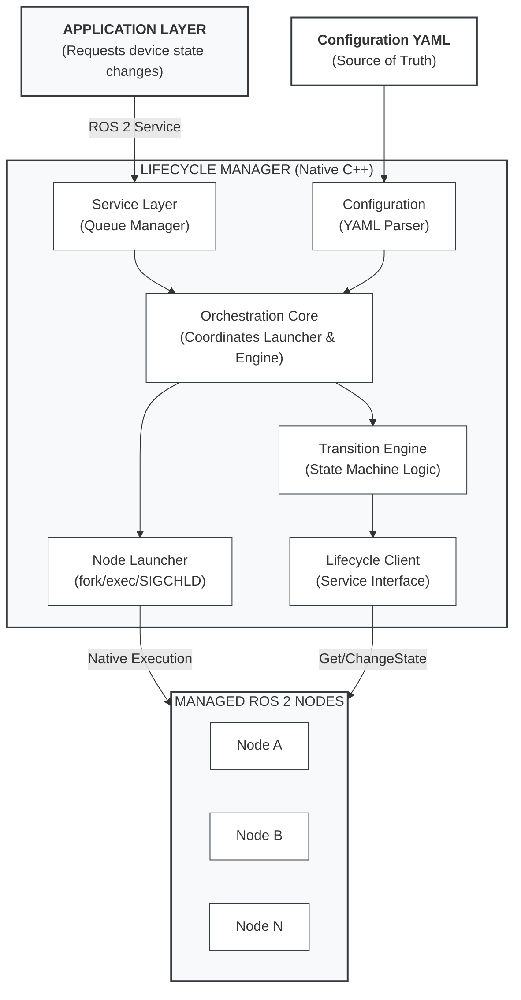
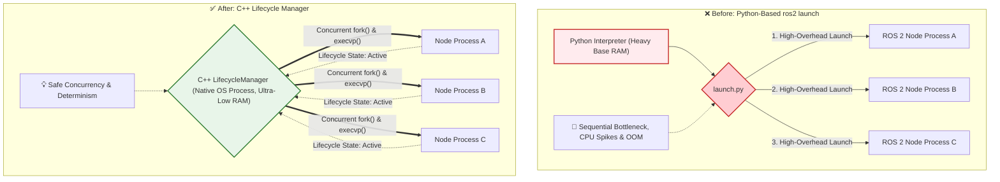
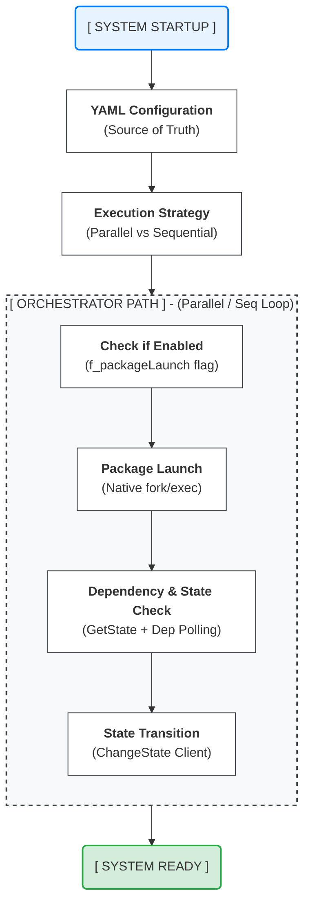

# A.RobotAI-LGE-ROS2-LifecycleManager
A C++ deterministic lifecycle orchestrator optimized for ROS 2 embedded systems.
>
## 🚀 Key Results
> ⚡ 81% faster boot time on real robot hardware  
> 💾 39% lower RAM usage vs `ros2 launch` (Stable)  
> 🧠 Deterministic ROS 2 lifecycle orchestration in C++

Validated on a commercial robot platform (IFA 2025 showcase).

## Performance Summary

- Boot time: **60.0s → 11.2s** (**-81%**)
- RAM usage (Stable): **442MB → 271MB** (**~39% reduction**)
- Peak RAM during boot: **229MB → 201MB**

📌 Tested on low-end embedded SoCs (e.g., 1GB RAM, Cortex-A35/A53)

📌 Boot time is defined as the time from process start until all required nodes reach the **ACTIVE** lifecycle state.

📌 Measurements are based on lifecycle activation logs and system-level monitoring (htop) under identical workloads.

👉 Enables ROS 2 deployment on hardware previously considered infeasible for full-stack execution.

## 🎯 Why this matters
ROS 2 is powerful, but still too heavy for low-cost embedded robots.

This project demonstrates that ROS 2 can be:
- deployed on 1GB-class hardware
- booted deterministically
- used in real production environments

## ⚖️ Comparison

| Approach              | Strengths                          | Limitations |
|----------------------|------------------------------------|-------------|
| ros2 launch (Python) | Flexible, easy to use              | High RAM usage, non-deterministic startup |
| systemd              | Stable process management          | No ROS 2 lifecycle awareness |
| ROS 2 Composition    | Efficient intra-process execution  | No system-level orchestration |
| micro-ROS            | Optimized for MCUs                 | Not for Linux-based systems |
| **LifecycleManager** | Deterministic, low-overhead, lifecycle-aware | Production-focused |


> 🚧 **[NOTICE] Project Status**
>
> This repository provides architectural documentation, YAML-based configuration
> examples, and empirical validation results for the Deterministic Lifecycle Manager.
>
> The execution model, lifecycle semantics, dependency resolution strategy, and
> performance characteristics are fully documented here to allow technical review
> and reproduction of system behavior.
>
> The complete C++ source code is planned to be released under the Apache License 2.0
> following internal compliance procedures.


## 📑 Table of Contents
1. [Overview - "What & Why?"](#1-overview---what--why)
2. [Structural Pain Points in Production Systems - "Pain Point"](#2-structural-pain-points-in-production-systems)
3. [Architecture & LifecycleManager - "Solution"](#3-architecture--lifecyclemanager)
4. [Deterministic Boot Flow - "Deep-dive"](#4-deterministic-boot-flow-deep-dive)
5. [Metrics & Validation - "Validation"](#5-metrics--validation)
6. [Source, Build & License - "Open-Source Status"](#6-source-build--license)
---
## 1. Overview - "What & Why?"
This document introduces the **"Deterministic Lifecycle Manager"**, a C++‑based lifecycle orchestration service designed to run ROS 2 reliably on low‑end embedded robotic platforms.
The target systems are cost-constrained commercial robotic platforms built on entry-level SoCs such as **Rockchip PX30, LG DQ1**, or other Cortex-A35-class CPUs, typically equipped with **less than 1GB of RAM**. On these platforms, boot-time behavior and peak resource usage critically impact system stability.
### 🔴 Motivation
During system integration and production‑equivalent platform evaluation, we repeatedly encountered critical issues when using the standard Python‑based `ros2 launch` workflow on resource‑constrained hardware.
The most common problems were:
* High baseline RAM usage before application logic starts
* Large CPU spikes during parallel node startup
* Frequent OOM (Out Of Memory) kills during early boot
* Unstable and non-deterministic startup sequences in production images
These issues were consistently reproducible across multiple low-end SoCs and robot products. They could not be resolved in a reliable way through parameter tuning, launch configuration changes, or partial optimization. 
**Our conclusion** was that the problems originated from the runtime overhead and process model of the Python-based launch system itself, which does not scale well under tight CPU and memory constraints.
### 🟢 Design Approach
To address these limitations, we implemented the **Deterministic Lifecycle Manager** as a minimal, native C++ service that launches and supervises ROS 2 nodes directly as OS-level processes.
Key characteristics include:
* **Zero Python dependency** on the target system
* ROS 2 nodes built and executed as native C++ binaries
* **Fast and Safe Concurrent Spawning:** Utilizes C++ threads alongside standard POSIX primitives (`fork()`, `execvp()`, `SIGCHLD`) to achieve parallel execution suited for resource-constrained systems.
*   **Dual-Launch "Benchmark Mode":** Supports toggling between native C++ spawning and legacy script-based execution (`std::system()`) to allow direct A/B performance comparisons (e.g., Python vs. C++ native).
This design preserves existing ROS 2 components—including DDS communication and lifecycle semantics—while eliminating the runtime overhead introduced by Python-based launch tooling.
> **💡 Note:** Deterministic Lifecycle Manager is *not* a replacement for ROS 2. It is a focused orchestration layer that provides deterministic and resource-efficient boot and lifecycle management, specifically tailored for low-end embedded systems used in cost-constrained production robots.

## 2. Why Python launch breaks on low-end SoCs - "Pain Point"
### Structural Pain Points in Production Systems
This section explains why the standard Python‑based `ros2 launch` workflow becomes a reliability bottleneck on low‑end SoCs, based on issues repeatedly observed during production‑equivalent system integration.
#### 2.1 Excessive Runtime Overhead During Boot
`ros2 launch` relies on Python processes that are loaded and initialized during system boot.
* On low‑end platforms with limited CPU performance and less than 1 GB of RAM, this introduces **substantial overhead before any application logic starts**.
* As the number of nodes increases, Python interpreter initialization and runtime management consume a significant portion of system resources, frequently leading to **memory pressure and OOM (Out Of Memory) events during early boot**.
#### 2.2 Non‑Deterministic Startup Under CPU Contention
* On entry‑level CPUs (such as Cortex‑A35‑class cores), parallel startup of multiple Python processes causes **severe CPU contention** during boot.
* Although `ros2 launch` supports parallel spawning, it does not enforce strict OS‑level startup ordering or readiness guarantees.
* As a result, dependent nodes may start before prerequisite nodes are fully initialized, leading to **race conditions and unstable boot behavior** in production environments.
#### 2.3 Fragmented Lifecycle Control After Launch
The launch system focuses on process creation and parameter loading.
* After startup, lifecycle state transitions are not centrally coordinated.
* In systems managing many nodes, this results in fragmented lifecycle handling, **uncoordinated state transitions**, and the absence of a single authoritative component responsible for global system state—an important weakness on resource‑constrained platforms.
#### 2.4 Mismatch Between Robot Missions and Lifecycle Semantics
ROS 2 lifecycle states are intentionally minimal and low‑level, while production robots operate in mission‑level modes such as standby or navigation.
* Without centralized orchestration, mapping mission‑level behavior to coordinated lifecycle transitions across multiple nodes becomes **error‑prone and difficult to validate**, especially on low‑end SoCs where deterministic behavior is critical.
> **💡 Summary**  
> On low‑end embedded platforms, the Python‑based launch system introduces overhead and non‑determinism during boot and state transitions. **These limitations are structural and cannot be reliably mitigated through launch configuration alone**, motivating a native and deterministic lifecycle orchestration approach.

## 3. Architecture & LifecycleManager - "Solution"

### A Modular Solution for Complex Systems

The Lifecycle Manager is a multi-threaded C++ ROS 2 node that acts as a centralized lifecycle coordinator. It utilizes a specialized Dual-Thread Architecture:
*   **Spin Thread:** Dedicated to handling ROS 2 communications and service callbacks.
*   **Main Thread:** Manages the core orchestration loop, including package spawning and the `processQueue()` mechanism. This non-blocking queue ensures that state transition requests are serialized and processed deterministically.

It operates alongside the standard ROS 2 launch infrastructure and is structured around five core modules:



*   **Service Layer** – Exposes the `/lifecycle_transition_device` ROS 2 service and manages a thread-safe work queue. It supports string-based state transition requests (e.g., "NORMAL", "SLEEP") for improved human readability and CLI usability.
*   **Config Engine** – A centralized YAML parser that serves as the single source of truth. It supports professional name-based device state definitions, removing the need for fragile numeric indexing.
*   **Transition Engine** – The central orchestrator that coordinates complex lifecycle state machines across multiple packages. It implements the serialization of state transition requests to prevent race conditions during concurrent updates.
*   **Node Launcher** – Handles native process spawning via POSIX `fork`/`exec` and monitors child process health using `SIGCHLD`. It manages dynamic path resolution and per-process log redirection.
    *   **Benchmarking Mode:** Includes a specialized execution path for legacy `.py`/`.sh` launch scripts (via `system()`), enabling deterministic A/B testing against standard Python launches.
*   **Lifecycle Client** – Interfaces with managed nodes using standard ROS 2 `GetState` and `ChangeState` services, featuring robust retry mechanisms and health monitoring.

**Architecture Independence** – By relying exclusively on POSIX standard system calls (`fork`, `execvp`, `sigaction`) and standard ROS 2 APIs, the Manager achieves 100% portability between ARM64 and x86_64 architectures. This ensures consistent behavioral deterministic across all development and deployment platforms.

### 📊 Architecture Comparison
The following diagram illustrates the fundamental architectural shift from a heavy Python interpreter to our lightweight C++ native orchestrator.



### ⚙️ YAML-Driven Configuration
All orchestration behavior is defined declaratively in a single YAML file:

```yaml
# Example: Configuration with Professional State Names
LIFECYCLE_MANAGER_CONFIG:
  DEVICE_STATE_NAMES: ["NORMAL", "SLEEP", "POWERSAVE"]

PACKAGE_slam_package:
  PACKAGE_ENABLE: true
  NODE_slam_node:
    EXECUTABLE: slam_node
    DEPENDENCY: ["lidar_package,lidar_node"]
    DEVICE_STATE_NORMAL: ACTIVE
    DEVICE_STATE_SLEEP: INACTIVE
```

Key configuration capabilities:
*   **Launch mode (`use_launch_script`):** Selects between native binary spawning (default/performance) or script-based execution (benchmarking)
*   **Transition strategy:** Parallel (multi-threaded) or sequential execution
*   **Dependency declaration:** Inter-node startup ordering
*   **Device state mapping:** Per-node lifecycle targets for each robot mission state

### 🔁 Multi-Step Lifecycle State Machine
The ROS 2 lifecycle standard does not allow direct transitions between certain primary states. The Lifecycle Manager resolves all intermediate steps automatically:

```text
UNCONFIGURED ➔ ACTIVE     : Configure ➔ Activate  (two-step)
ACTIVE ➔ UNCONFIGURED     : Deactivate ➔ Cleanup  (two-step)
UNCONFIGURED ➔ INACTIVE   : Configure
INACTIVE ➔ ACTIVE         : Activate
ACTIVE ➔ INACTIVE         : Deactivate
Any state ➔ FINALIZED     : Appropriate shutdown transition
```
The application layer simply declares a target state; the Lifecycle Manager resolves and executes all intermediate transitions transparently, each wrapped with configurable retry and timeout policies.

### 🤖 Device State Abstraction
To bridge the semantic gap between robot missions and low-level lifecycle states, the Lifecycle Manager introduces a "Device State" abstraction.

| Node \ Device State | NORMAL | SLEEP | POWERSAVE |
| :--- | :--- | :--- | :--- |
| `slam_node` | ACTIVE | INACTIVE | FINALIZED |
| `lidar_node` | ACTIVE | INACTIVE | FINALIZED |
| `navigation_node` | ACTIVE | INACTIVE | FINALIZED |
| `motor_node` | ACTIVE | INACTIVE | FINALIZED |
| `camera_node` | ACTIVE | ACTIVE | INACTIVE |
| `diagnostic_node` | ACTIVE | ACTIVE | ACTIVE |

To switch the robot from "NORMAL" to "SLEEP", just call:

```bash
ros2 service call /lifecycle_transition_device lifecycle_manager_msgs/srv/TransitionDevice "{request: 'SLEEP'}"
```

This single call automatically transitions each node to its matching target state — navigation and motor stop, while camera and diagnostics stay running. This design completely decouples mission logic from lifecycle management.

## 4. Deterministic Boot Flow (how it works) - "Deep-dive"

### Technical Logic from Initialization to Operation
The Lifecycle Manager follows a rigorous, deterministic sequence to ensure all nodes are prepared and synchronized.

By identifying independent node groups at runtime from YAML dependency declarations (e.g., `DEPENDENCY: ["pkg_name,node_name"]`), the system initializes multiple packages concurrently — reducing the theoretical boot time from **`O(N)`** sequential initialization to **`O(Depth(G))`**, where `Depth(G)` is the longest dependency path in the package graph.
In other words, boot time becomes bounded by the longest dependency chain rather than the total number of nodes.




### Startup Sequence (Step-by-Step)

1. **Load YAML Configuration** — Reads all package/node definitions, dependencies, and device-state mappings from a single YAML file.
2. **Select Execution Strategy** — Determines parallel (multi-threaded) or sequential mode per YAML configuration.
3. **Native Process Spawning** — Each package binary is launched via `fork`/`exec` with executable paths resolved dynamically by `ament_index_cpp`. Per-process log files are created with timestamps.
4. **Dependency Wait** — For each node, polls the managed-state of declared dependency nodes until they reach `ACTIVE` (30-second timeout).
5. **Lifecycle State Polling** — Calls `GetState` service with retry until the node responds, confirming it is alive and ready for state transitions.
6. **Initial State Transition** — Applies the `DEVICE_INIT` target lifecycle state via the multi-step state machine (e.g., triggering `Configure ➔ Activate` for an `ACTIVE` target).

After all nodes reach their initial states, the system enters the operational phase — waiting for Device State requests via `/lifecycle_transition_device` and applying per-node lifecycle targets through the `TransitionEngine`.

## 5. Metrics & Validation - "Validation"

This section validates the impact of Deterministic Lifecycle Manager using measurements collected on a **pre-production commercial cleaning robot platform publicly showcased at IFA 2025**. 

For evaluation purposes, the product's software stack was ported to ROS 2, system interfaces were redesigned, and the C++ DLM was deployed directly on the target hardware. The goal was realistic system-level evaluation under severe production constraints (CPU limitations, memory pressure, and real boot-time behavior). All measurements were performed on identical hardware using the same ROS 2 node set.


### 🧪 Test Environment
| ITEM | Specification |
| :--- | :--- |
| **HW Platform (AP)** | LG DQ1 (Cortex-A53x4 @ 1GHz) |
| **RAM** | 1GB |
| **eMMC** | 4GB |
| **ROS 2 Distribution** | ROS 2 Humble |
| **Managed ROS 2 Nodes** | 12 nodes + lifecycle node |
| **OS** | Yocto based ROS 2 |
| **Yocto Version** | Kirkstone |

### 🚀 Boot Configurations
Two boot configurations were evaluated:
*   **Baseline: ROS 2 default Python-based launch**
    ROS 2 nodes were started using the standard `ros2 launch` workflow, which loads the Python interpreter and initializes the launch framework during system boot.
*   **Modified: Binary-based launch using Deterministic Lifecycle Manager**
    All ROS 2 nodes were executed directly as OS processes under DLM control, without involving the Python runtime.

> *No other system components or ROS 2 node implementations were changed between the two configurations.*

### 📈 Results
The measured results are summarized in the data below.

#### TABLE I. STARTUP PERFORMANCE COMPARISON
| Metric | Python-based launch | C++ DLM (Proposed) |
| :--- | :---: | :---: |
| Boot time (s) | 59.96 ± 0.70 | 11.20 ± 0.68 |
| Avg RAM during boot (MB) | 228.95 ± 1.80 | 201.28 ± 8.59 |
| Stable RAM 5 s after boot (MB) | 441.97 ± 1.41 | 270.86 ± 1.83 |
> *Values are averaged over ten repeated runs (Mean ± Std. Dev.).*

*   Boot completion time was reduced from **59.96s to 11.20s**, corresponding to an **81.3% reduction**.
*   Stable memory usage after startup decreased from **441.97MB to 270.86MB**, corresponding to a **38.7% reduction**.
*   **CPU contention spikes** observed during early boot in the baseline configuration were significantly minimized.

#### 📊 Performance Charts

| Legacy Sequential Python Launch | Proposed Parallel Native C++ DLM |
| :---: | :---: |
|  |  |

<p align="center">
  <em>Left: Legacy Sequential Python Launch | Right: Proposed Parallel Native C++ DLM</em>
</p>

#### 📋 Chart Data Summary

*   **⏱️ Execution Time Comparison (Boot Speed)**
    *   Python Launch: `59.96s`
    *   Binary (C++): `11.20s`
    *   **Improvement: ↓ 81.3%** `(59.96s ➔ 11.20s)`
    
*   **💾 Stable Memory Usage Comparison (RAM)**
    *   Python Launch: `441.97MB`
    *   Binary (C++): `270.86MB`
    *   **Improvement: ↓ 38.7%** `(441.97MB ➔ 270.86MB)`

## 🧪 Reproducibility

All experiments were conducted on identical hardware and software configurations.

- Same nodes and execution graph
- Same workload
- Only the orchestration mechanism was changed (Python-based ros2 launch vs LifecycleManager)

Detailed configuration and setup are available in this repository.

A side-by-side boot comparison (Legacy Python vs. Native C++ DLM) is shown in the Performance Charts section above. 

> **💡 Benchmark Reproducibility:**  
> The 82% performance gain was verified using the built-in **Benchmark Mode**. By toggling the `use_launch_script` flag in the same LifecycleManager instance, we compared identical node sets launched via Python scripts vs. direct C++ native spawning, ensuring the improvement is attributed solely to the orchestration overhead reduction.

> **Conclusion:** By removing Python from the runtime path, memory pressure during system startup was reduced enough to **completely eliminate OOM events** observed in the baseline configuration. These improvements were achieved without modifying the ROS 2 nodes themselves, and resulted in a stable and repeatable boot sequence on the target hardware.

## 6. Source, Build & License

### ⚙️ Technical Requirements
*   **Architecture:** `x86_64` (Development/PC) and `ARM64/AArch64` (Embedded Target)
*   **OS:** Ubuntu 22.04 (Jammy) or later / Linux (Yocto-based)
*   **ROS 2:** Humble, Iron, or Jazzy
*   **Compiler:** C++17 or higher (Required for `<filesystem>` and modern C++ features)
*   **Dependencies:** `rclcpp`, `lifecycle_msgs`, `lifecycle_manager_msgs`, `yaml-cpp`

---

### 🛠️ Build Instructions

**1. Build:**
Use `colcon` to build the orchestration packages in your standard workspace.
```bash
colcon build --packages-select lifecycle_manager_msgs lifecycle_manager
```

**2. Deploy:**
Push (copy) the resulting build artifacts (binaries and libraries) to your target robot system or staging environment.

**3. Run:**
You can launch the manager using the provided launch file (recommended) or run the binary directly with your custom configuration.

**Option A: Using the launch file (Recommended)**
```bash
ros2 launch lifecycle_manager lifecycle_manager.launch.py
```

**Option B: Direct execution with custom parameters**
```bash
ros2 run lifecycle_manager lifecycle_manager --ros-args --params-file ./your_config.yaml
```

---

### 📝 License & Source Code Access
This project is licensed under the **Apache License 2.0**, allowing internal commercial use as well as future open-source contributions.

As described at the top of this document, this repository currently provides architectural documentation, configuration examples, and empirical validation results that fully describe the execution model and lifecycle behavior of the system.

The complete C++ source code is planned to be released under the same license following completion of internal compliance procedures.
