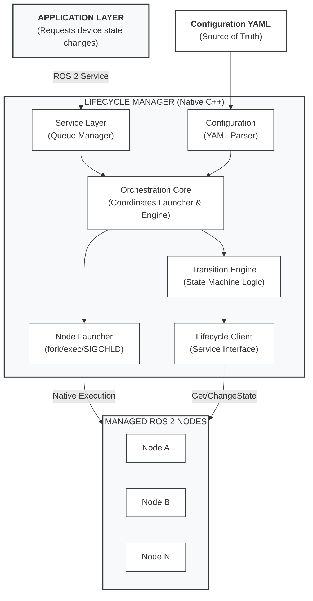
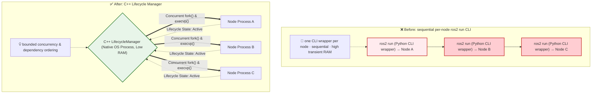
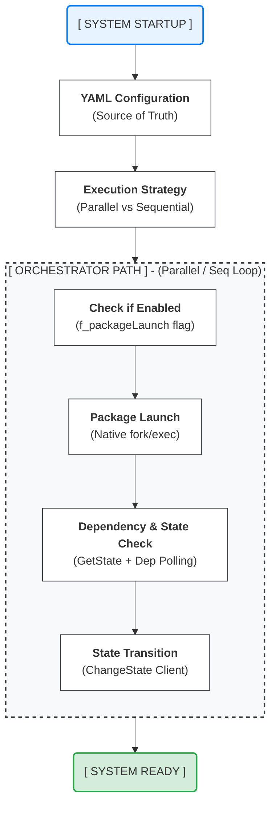
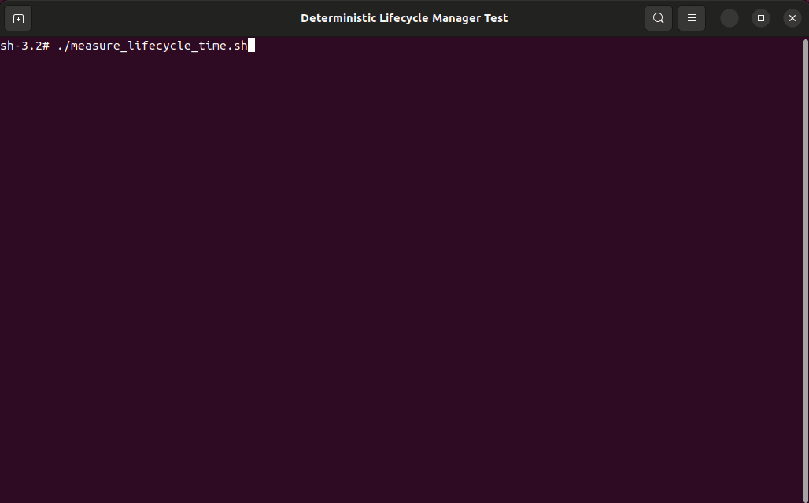
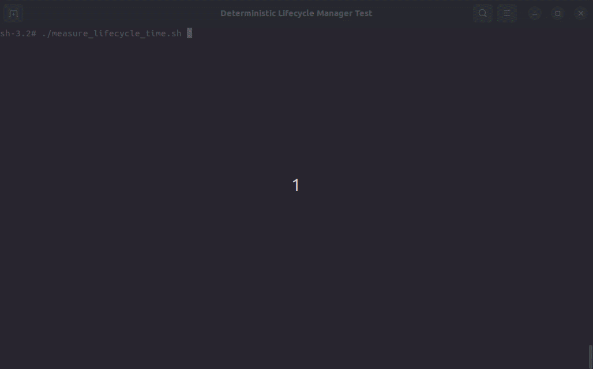

# A.RobotAI-LGE-ROS2-LifecycleManager
A C++ lifecycle orchestration layer for ROS 2 on resource-constrained embedded systems.
>
## 🚀 Key Results
> ⚡ 82.1% faster boot time on real robot hardware
> 💾 40.7% lower stable RAM vs a sequential per-node `ros2 run` (CLI) baseline
> 🧠 Dependency-ordered, low-overhead ROS 2 lifecycle orchestration in C++

Validated on a commercial robot platform (IFA 2025 showcase).

> **⚠️ Scope of comparison:** All results below are reported **relative to a sequential per-node `ros2 run` (CLI) bring-up**, i.e., each node started through a separate `ros2 run` invocation via `std::system()`. We do **not** claim results relative to the parallel-capable `ros2 launch` system.

## Performance Summary

Measured across three configurations (10 runs each) on the same hardware and node set:

- Boot time: **60.04 s → 10.74 s** (**−82.1%**, sequential `ros2 run` CLI → C++ DLM)
- Stable RAM: **464.09 MiB → 275.07 MiB** (**−40.7%**)
- Avg RAM during boot: **247.34 MiB → 189.58 MiB** (**−23.3%**)

An ablation isolates the two effects (see §5): removing the CLI/interpreter front end (native `fork`/`exec`) accounts for essentially all of the memory saving, while dependency-aware parallel activation drives most of the remaining boot-time reduction.

📌 Tested on a low-end embedded SoC (LG DQ1, quad Cortex-A53 @ 1 GHz, 1 GB RAM).

📌 **Boot time** is measured from the manager's start log entry to the initialization-complete marker (emitted after all initialization worker threads join). Every run was verified to contain all 14 managed nodes in the **ACTIVE** state.

📌 **Memory** is whole-system used memory (from `free`), not per-process RSS. The stable value is sampled **90 s after all nodes reach ACTIVE**; raw KiB counters are converted to MiB.

👉 These results suggest a practical deployment path for ROS 2 on highly constrained embedded hardware.

## 🎯 Why this matters
ROS 2 can remain challenging to deploy on low-cost embedded robots when memory budgets and startup constraints are tight.

This project demonstrates that ROS 2 can be:
- deployed on 1 GB-class hardware
- brought up with dependency-ordered lifecycle coordination
- used in real production environments

## ⚖️ Comparison

| Approach              | Strengths                          | Limitations |
|----------------------|------------------------------------|-------------|
| Per-node `ros2 run` (CLI, Python front end) | Simple, no launch file needed | Interpreter overhead per node, sequential, high transient RAM |
| `ros2 launch` (Python) | Flexible, concurrent start, event handlers | Interpreter overhead; launch-based orchestration |
| systemd              | Stable process management          | No ROS 2 lifecycle awareness |
| ROS 2 Composition    | Efficient intra-process execution  | No system-level orchestration; shared address space |
| micro-ROS            | Optimized for MCUs                 | Not for Linux-based systems |
| **LifecycleManager** | Dependency-ordered, low-overhead, lifecycle-aware | More integration effort than default launch-based workflows |


> 🚧 **[NOTICE] Project Status**
>
> This repository currently provides architecture documentation, YAML configuration examples,
> measurement methodology, and empirical validation results for the Deterministic Lifecycle Manager.
>
> These materials are intended to make the design and observed system behavior technically reviewable
> before the full implementation is publicly released.
>
> A partial or full source release under Apache License 2.0 is being prepared through internal compliance review.

## 📑 Table of Contents
1. [Overview - "What & Why?"](#1-overview---what--why)
2. [Structural Pain Points in Production Systems - "Pain Point"](#2-structural-pain-points-in-production-systems---pain-point)
3. [Architecture & LifecycleManager - "Solution"](#3-architecture--lifecyclemanager---solution)
4. [Deterministic Boot Flow - "Deep-dive"](#4-deterministic-boot-flow---deep-dive)
5. [Metrics & Validation - "Validation"](#5-metrics--validation---validation)
6. [Source, Build & License - "Open-Source Status"](#6-source-build--license---open-source-status)
---
## 1. Overview - "What & Why?"
This document introduces the **"Deterministic Lifecycle Manager"** (DLM), a C++‑based lifecycle orchestration service designed to run ROS 2 reliably on low‑end embedded robotic platforms.
The target systems are cost-constrained commercial robotic platforms built on entry-level SoCs such as **Rockchip PX30, LG DQ1**, or other Cortex-A35/A53-class architectures, typically equipped with **around 1 GB of RAM**. On these platforms, boot-time behavior and peak resource usage critically impact system stability.
### 🔴 Motivation
During system integration and production‑equivalent platform evaluation, we repeatedly encountered critical issues when bringing up ROS 2 nodes through an **interpreter-based, per-node `ros2 run` (CLI) path** on resource‑constrained hardware.
The most common problems were:
* High baseline RAM usage before application logic starts
* Frequent OOM (Out Of Memory) kills during early boot
* Unstable and non-deterministic startup sequences in production images
Similar issues were repeatedly observed during evaluation on multiple low-end platforms, with the detailed quantitative results in this repository collected on the LG DQ1-based test platform. In our evaluated configuration, these issues were not sufficiently resolved through parameter tuning, configuration changes, or partial optimization.
**Our working conclusion** was that orchestration overhead in the evaluated interpreter-based launch path was a major contributor under tight memory constraints.
### 🟢 Design Approach
To address these limitations, we implemented the **Deterministic Lifecycle Manager** as a minimal, native C++ service that launches and supervises ROS 2 nodes directly as OS-level processes.
Key characteristics include:
* **No Python front-end dependency** in the native launch path on the target system
* ROS 2 nodes built and executed as native C++ binaries
* **Hardware-Aware Concurrent Spawning:** Utilizes C++ worker threads alongside standard POSIX primitives (`fork()`, `execvp()`, `SIGCHLD`) to balance parallel execution. By bounding the number of simultaneous process launches to the system hardware concurrency (CPU cores), it limits CPU contention and OS scheduler overhead.
*   **Dual-Mode "Benchmark Mode":** Supports toggling between native C++ spawning and legacy per-node CLI execution (`std::system("ros2 run …")`) to allow direct A/B performance comparisons.
This design preserves standard ROS 2 lifecycle semantics and DDS-based communication while reducing the runtime overhead associated with the evaluated interpreter-based launch path.
> **💡 Note:** The name "Deterministic" refers to **dependency-constrained, repeatable completion** (activation respects the dependency partial order and the same set of nodes reaches ACTIVE on every run) — **not** hard real-time or exact-timing guarantees. Under parallel activation, exact per-run timing varies with thread scheduling.

## 2. Structural Pain Points in Production Systems - "Pain Point"
### Structural Pain Points in Production Systems
This section explains why an interpreter-based, per-node bring-up path becomes a reliability bottleneck on low‑end SoCs, based on issues repeatedly observed during production‑equivalent system integration.
#### 2.1 Excessive Runtime Overhead During Boot
Interpreter-based bring-up (e.g., per-node `ros2 run`, or `ros2 launch`) relies on Python processes that are loaded and initialized during system boot.
* On low-cost hardware with 1 GB or less of RAM, this introduces **substantial overhead before any application logic starts**.
* As the number of nodes increases, Python interpreter initialization and runtime management consume a significant portion of system resources, frequently leading to **memory pressure and OOM (Out Of Memory) events during early boot**.
#### 2.2 Non‑Deterministic Startup
* A per-node CLI bring-up does not enforce strict OS‑level startup ordering or readiness guarantees.
* As a result, dependent nodes may start before prerequisite nodes are fully initialized, leading to **race conditions and unstable boot behavior** in production environments.
#### 2.3 Fragmented Lifecycle Control After Launch
CLI/launch-based bring-up focuses on process creation and parameter loading.
* After startup, lifecycle state transitions are not centrally coordinated.
* In systems managing many nodes, this results in fragmented lifecycle handling, **uncoordinated state transitions**, and the absence of a single authoritative component responsible for global system state—an important weakness on resource‑constrained platforms.
#### 2.4 Mismatch Between Robot Missions and Lifecycle Semantics
ROS 2 lifecycle states are intentionally minimal and low‑level, while production robots operate in mission‑level modes such as standby or navigation.
* Without centralized orchestration, mapping mission‑level behavior to coordinated lifecycle transitions across multiple nodes becomes **error‑prone and difficult to validate**, especially on low‑end SoCs where deterministic behavior is critical.
> **💡 Summary**
> On low‑end embedded platforms, interpreter-based bring-up introduces overhead and non‑determinism during boot and state transitions.
> **In our evaluated setup, these limitations were not sufficiently mitigated through configuration alone.**
> This motivated a native, dependency-ordered lifecycle orchestration approach.
## 3. Architecture & LifecycleManager - "Solution"

### A Modular Solution for Complex Systems

The Lifecycle Manager is a multi-threaded C++ ROS 2 node that acts as a centralized lifecycle coordinator. It separates communication from orchestration across distinct execution contexts:
*   **Spin Thread:** Runs a ROS 2 executor dedicated to communications and service callbacks.
*   **Orchestration Thread:** Manages the core orchestration loop, including package spawning and the `processQueue()` mechanism. This non-blocking queue serializes state-transition requests so they are processed in a repeatable order.
*   **Bounded Worker Concurrency:** Concurrent process spawning is dispatched to a pool capped at the system hardware concurrency, bounding the number of simultaneous node transitions.


It operates as a ROS 2-native orchestration component within a standard ROS 2 system, while avoiding dependence on the Python front-end path in the evaluated deployment mode.

The system is structured around five core modules:




*   **Service Layer** – Exposes the `/lifecycle_transition_device` ROS 2 service and manages a thread-safe work queue. It supports string-based state transition requests (e.g., "NORMAL", "SLEEP") for improved human readability and CLI usability.
*   **Config Engine** – A centralized YAML parser that serves as the single source of truth. It supports name-based device state definitions, removing the need for fragile numeric indexing.
*   **Transition Engine** – The central orchestrator that coordinates lifecycle state machines across multiple packages. It serializes state transition requests to prevent race conditions during concurrent updates.
*   **Node Launcher** – Handles native process spawning via POSIX `fork`/`exec` and detects child-process termination via `SIGCHLD` (asynchronously reaping exited children to prevent zombie accumulation). It manages dynamic path resolution (`ament_index_cpp`) and per-process log redirection.
    *   **Benchmarking Mode:** Includes a specialized execution path for legacy per-node CLI/script launches (via `std::system()`), enabling A/B testing against the native path.
*   **Lifecycle Client** – Interfaces with managed nodes using standard ROS 2 `GetState` and `ChangeState` services, with per-operation timeouts and bounded retries.

**Architecture Independence** – By relying exclusively on POSIX standard system calls (`fork`, `execvp`, `sigaction`) and standard ROS 2 APIs, the Manager is designed to be portable across common Linux targets such as ARM64 and x86_64, subject to standard ROS 2 and platform integration constraints.

### 📊 Architecture Comparison
The following diagram illustrates the shift from an interpreter-based, per-node CLI bring-up to a lightweight C++ native orchestrator.



### ⚙️ YAML-Driven Configuration
All orchestration behavior is defined declaratively in a single YAML file:

```yaml
# Example: Configuration with device state names
LIFECYCLE_MANAGER_CONFIG:
  DEVICE_STATE_NAMES: ["NORMAL", "SLEEP", "POWERSAVE"]
  USE_LAUNCH_SCRIPT: false
  NODE_TRANSITION_STRATEGY: "parallel"

PACKAGE_slam_package:
  PACKAGE_ENABLE: true
  NODE_slam_node:
    EXECUTABLE: slam_node
    ARGUMENT: ["--param_a", "value_a"]
    DEPENDENCY: ["lidar_package,lidar_node"]
    DEVICE_INIT: ACTIVE
    DEVICE_STATE_NORMAL: ACTIVE
    DEVICE_STATE_SLEEP: INACTIVE
    DEVICE_STATE_POWERSAVE: FINALIZED
```

Key configuration capabilities:
*   **Launch mode (`USE_LAUNCH_SCRIPT`):** Selects between native binary spawning (fork/exec) or per-node CLI/script execution (benchmarking)
*   **Transition strategy (`NODE_TRANSITION_STRATEGY`):** Parallel (multi-threaded) or sequential execution
*   **Executable arguments (`ARGUMENT`):** Command-line arguments for the native process
*   **Dependency declaration (`DEPENDENCY`):** Inter-node startup ordering and readiness polling
*   **Initialization target (`DEVICE_INIT`):** Specific lifecycle state for initial boot
*   **Device state mapping (`DEVICE_STATE_<NAME>`):** Per-node lifecycle targets for each robot mission state

### 🔁 Multi-Step Lifecycle State Machine
The ROS 2 lifecycle standard does not allow direct transitions between certain primary states. The Lifecycle Manager resolves all intermediate steps automatically:

```text
UNCONFIGURED ➔ ACTIVE     : Configure ➔ Activate  (two-step)
ACTIVE ➔ UNCONFIGURED     : Deactivate ➔ Cleanup  (two-step)
UNCONFIGURED ➔ INACTIVE   : Configure
INACTIVE ➔ ACTIVE         : Activate
ACTIVE ➔ INACTIVE         : Deactivate
Any state ➔ FINALIZED     : Appropriate shutdown transition
```
The application layer simply declares a target state; the Lifecycle Manager resolves and executes all intermediate transitions transparently, each wrapped with configurable retry and timeout policies.

### 🤖 Device State Abstraction
To bridge the semantic gap between robot missions and low-level lifecycle states, the Lifecycle Manager introduces a "Device State" abstraction.

| Node \ Device State | NORMAL | SLEEP | POWERSAVE |
| :--- | :--- | :--- | :--- |
| `slam_node` | ACTIVE | INACTIVE | FINALIZED |
| `lidar_node` | ACTIVE | INACTIVE | FINALIZED |
| `navigation_node` | ACTIVE | INACTIVE | FINALIZED |
| `motor_node` | ACTIVE | INACTIVE | FINALIZED |
| `camera_node` | ACTIVE | ACTIVE | INACTIVE |
| `diagnostic_node` | ACTIVE | ACTIVE | ACTIVE |

To switch the robot from "NORMAL" to "SLEEP", just call:

```bash
ros2 service call /lifecycle_transition_device lifecycle_manager_msgs/srv/TransitionDevice "{request: 'SLEEP'}"
```

This single call automatically transitions each node to its matching target state — navigation and motor stop, while camera and diagnostics stay running. This design decouples mission logic from lifecycle management.

## 4. Deterministic Boot Flow - "Deep-dive"

### Technical Logic from Initialization to Operation
The Lifecycle Manager follows a rigorous, dependency-ordered sequence to ensure all nodes are prepared and synchronized.

By identifying independent node groups at runtime from YAML dependency declarations (e.g., `DEPENDENCY: ["pkg_name,node_name"]`), the system initializes multiple packages concurrently. Rather than scaling with the total node count `N`, completion time is bounded by **both the dependency critical path and the available parallelism** — approximately `max(L, W/c)`, where `L` is the longest dependency chain, `W` is the total node-initialization work, and `c` is the concurrency cap (hardware concurrency). In other words, boot time is governed by dependency depth and the concurrency cap rather than by node count alone.




### Startup Sequence (Step-by-Step)

1. **Load YAML Configuration** — Reads all package/node definitions, dependencies, and device-state mappings from a single YAML file.
2. **Select Execution Strategy** — Determines parallel (multi-threaded) or sequential mode per YAML configuration.
3. **Native Process Spawning** — Each package binary is launched via `fork`/`exec` with executable paths resolved dynamically by `ament_index_cpp`. Per-process log files are created with timestamps.
4. **Dependency Wait** — For each node, polls the managed-state of declared dependency nodes until they reach `ACTIVE` (30-second timeout).
5. **Lifecycle State Polling** — Calls `GetState` service with retry until the node responds, confirming it is alive and ready for state transitions.
6. **Initial State Transition** — Applies the `DEVICE_INIT` target lifecycle state via the multi-step state machine (e.g., triggering `Configure ➔ Activate` for an `ACTIVE` target).

After all nodes reach their initial states, the system enters the operational phase — waiting for Device State requests via `/lifecycle_transition_device` and applying per-node lifecycle targets through the `TransitionEngine`.

## 5. Metrics & Validation - "Validation"

This section validates the impact of the Deterministic Lifecycle Manager using measurements collected on a **pre-production commercial cleaning robot platform publicly showcased at IFA 2025**.

For evaluation purposes, the product's software stack was ported to ROS 2, system interfaces were redesigned, and the C++ DLM was deployed directly on the target hardware. The goal was realistic system-level evaluation under severe production constraints (memory pressure and strict boot-time requirements). All measurements were performed on identical hardware using the same ROS 2 node set.


### 🧪 Test Environment
| ITEM | Specification |
| :--- | :--- |
| **HW Platform (AP)** | LG DQ1 (Cortex-A53×4 @ 1 GHz) |
| **RAM** | 1 GB |
| **eMMC** | 4 GB |
| **ROS 2 Distribution** | ROS 2 Humble |
| **Managed ROS 2 Nodes** | 14 lifecycle nodes + 1 non-lifecycle transform process |
| **OS** | Yocto-based Linux |
| **Yocto Version** | Kirkstone |

### 🚀 Boot Configurations
Three configurations were evaluated. All bring up the **identical 14 nodes** with the same lifecycle targets and parameters on the same hardware and software stack; only the orchestration mechanism differs:
*   **(1) Baseline — sequential per-node `ros2 run` (CLI):**
    Each node is started through a separate `ros2 run` invocation (which loads the ROS 2 Python command-line front end), one after another (`USE_LAUNCH_SCRIPT: true`, `NODE_TRANSITION_STRATEGY: sequential`).
*   **(2) Native sequential:**
    Nodes are started as native `fork`/`exec` processes, sequentially, without a Python front end.
*   **(3) Proposed — C++ DLM (native + parallel):**
    Native `fork`/`exec` combined with dependency-aware parallel activation.

This staging isolates the contribution of removing the CLI/interpreter front end from that of dependency-aware scheduling.

> *No other system components or ROS 2 node implementations were changed between the configurations. Because our baseline is the sequential per-node CLI bring-up, we do not claim results relative to the parallel-capable `ros2 launch` system.*

### 📈 Results

#### TABLE I. STARTUP PERFORMANCE ABLATION
| Metric | `ros2 run` CLI (seq.) | Native exec (seq.) | C++ DLM (parallel) |
| :--- | :---: | :---: | :---: |
| Boot time (s) | 60.04 ± 0.64 | 34.62 ± 0.51 | 10.74 ± 0.77 |
| Avg RAM during boot (MiB) | 247.34 ± 1.32 | 140.16 ± 1.17 | 189.58 ± 8.44 |
| Stable RAM, 90 s after boot (MiB) | 464.09 ± 1.05 | 273.37 ± 1.88 | 275.07 ± 1.49 |
> *Values are averaged over ten repeated runs (Mean ± Std. Dev.). Memory is whole-system used memory (`free`), converted from KiB to MiB.*

*   Boot completion time was reduced from **60.04 s to 10.74 s**, a **−82.1%** reduction (baseline → DLM).
*   Stable memory usage after startup decreased from **464.09 MiB to 275.07 MiB**, a **−40.7%** reduction.
*   **Ablation:** removing the CLI/interpreter front end alone (config 1 → 2) cut boot time to 34.62 s (−42.3%) and accounts for essentially all of the memory saving (464.09 → 273.37 MiB, −41.1%); adding dependency-aware parallel activation (config 2 → 3) cut boot time to 10.74 s while leaving stable memory essentially unchanged (+0.6%). In absolute terms the two effects contribute comparably to the boot-time reduction (25.4 s and 23.9 s).

> **Note on variance:** the parallel configuration shows higher relative run-to-run *timing* variance than the sequential baselines (coefficient of variation ≈ 7% vs ≈ 1%). What is repeatable across runs is the *outcome*: activation respects the dependency partial order and the same set of nodes reaches ACTIVE on every run.

#### 📊 Performance Charts

| Legacy Sequential `ros2 run` CLI | Proposed Parallel Native C++ DLM |
| :---: | :---: |
|  |  |

<p align="center">
  <em>Left: Legacy Sequential per-node ros2 run CLI | Right: Proposed Parallel Native C++ DLM</em>
</p>

#### 📋 Chart Data Summary

*   **⏱️ Boot Time (baseline → DLM)**
    *   `ros2 run` CLI (seq.): `60.04 s`
    *   C++ DLM (parallel): `10.74 s`
    *   **Improvement: ↓ 82.1%** `(60.04 s ➔ 10.74 s)`

*   **💾 Stable RAM (baseline → DLM)**
    *   `ros2 run` CLI (seq.): `464.09 MiB`
    *   C++ DLM (parallel): `275.07 MiB`
    *   **Improvement: ↓ 40.7%** `(464.09 MiB ➔ 275.07 MiB)`

## 🧪 Reproducibility

All experiments were conducted on identical hardware and software configurations.

- Same nodes and execution graph
- Same workload
- Only the orchestration mechanism was changed (sequential per-node `ros2 run` CLI → native `fork`/`exec` → native + dependency-aware parallel)

Detailed configuration and setup are available in this repository.

A side-by-side boot comparison (Legacy per-node ros2 run CLI vs. Native C++ DLM) is shown in the Performance Charts section above.

> **💡 Benchmark Reproducibility:**
> The comparison was performed within the same LifecycleManager instance by toggling the `USE_LAUNCH_SCRIPT` and `NODE_TRANSITION_STRATEGY` flags, comparing identical node sets launched via per-node `ros2 run` CLI vs. native C++ spawning (sequential and parallel). This supports the interpretation that a large portion of the improvement is attributable to orchestration-path differences.

> **Conclusion:** By removing the Python front end from the evaluated runtime path, startup memory pressure was reduced, and OOM events observed in the baseline configuration were not reproduced in the evaluated DLM configuration. These improvements were achieved without modifying the ROS 2 nodes themselves and resulted in a repeatable boot sequence (in outcome) on the target hardware.

## 6. Source, Build & License - "Open-Source Status"

### ⚙️ Technical Requirements
*   **Architecture:** `x86_64` (Development/PC) and `ARM64/AArch64` (Embedded Target)
*   **OS:** Ubuntu 22.04 (Jammy) or later / Linux (Yocto-based)
*   **ROS 2:** Developed and evaluated on Humble; designed to be portable to Iron and Jazzy
*   **Compiler:** C++17 or higher (Required for `<filesystem>` and modern C++ features)
*   **Dependencies:** `rclcpp`, `lifecycle_msgs`, `lifecycle_manager_msgs`, `ament_index_cpp`

---


### 🛠️ Build / Run Status

The full implementation is not yet publicly available in this repository.

Build and run instructions will be added once the source release is completed.

Currently available in this repository:
- architecture documentation
- YAML configuration examples
- measurement methodology
- empirical validation results

---

### 📝 License & Source Code Access
This project is licensed under the **Apache License 2.0**, allowing internal commercial use as well as future open-source contributions.

As described at the top of this document, this repository currently provides architectural documentation, configuration examples, and empirical validation results that describe the execution model and lifecycle behavior of the system.

The complete C++ source code is planned to be released under the same license following completion of internal compliance procedures.
